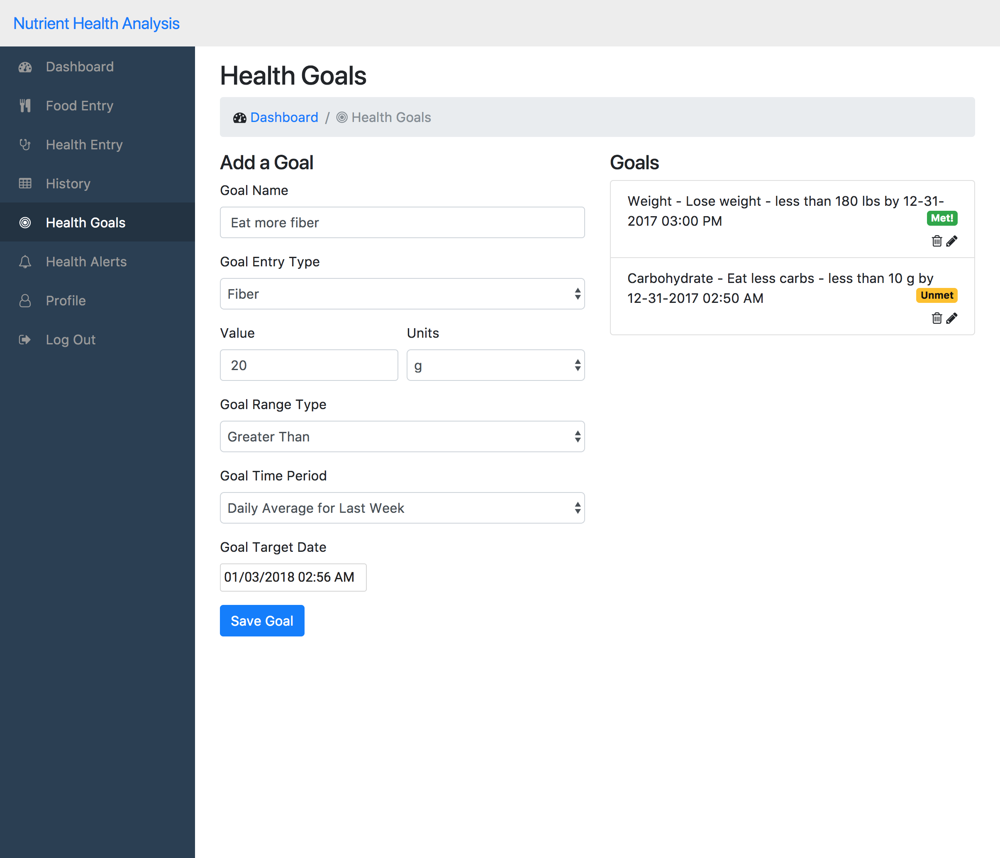

# Nutrient Health Analysis App

## Table of contents

- [Introduction](#introduction)
- [Installation](#installation)
  - [General user](#general-user)
  - [Developer](specialinstructions.md)
- [How to Use the Application](#how-to-use-the-application)
  - [Register](#register)
  - [Login](#login)
  - [Dashboard](#dashboard)
  - [Food Entry](#food-entry)
  - [Health Entry](#health-entry)
  - [History](#history)
  - [Alerts](#health-alerts)
  - [Goals](#health-goals)
  - [Profile](#profile)
- [FHIR Integration](#fhir-integration)
- [Links](#links)

### Introduction

A mobile and desktop application that allows diabetic patients to keep track of their food intake and health measurements, such as measured glucose levels and better manage their condition through personal alerts and goals.

### Installation

### General User

The application is built such that it is supported for any device with internet connectivity. Go to this [link](https://fhirtesting.hdap.gatech.edu/NutrientHealthAnalysis/login) on either your computer or mobile device. The application best runs on Google Chrome or Mozilla FireFox but Internet Explorer is also supported.

#### Developer

Please refer to [special instructions.md](specialinstructions.md).

### How to Use the Application

#### Register

##### Steps

1. From the landing page of the application, click on "register"
2. Fill in the user credentials you wish to save to create your account
3. Click on register
4. Once your user credentials are validated successfully you will be redirected to the login page to login

##### Example

#### Login

##### Steps

1. Enter in your saved user account credentials to log into your account
- Enter in your username
- Enter in your password
2. Click on login

##### Example

#### Dashboard

Upon login, you will be able to see at a glance some key metrics about your health and usage in the application. 

- Average weight
- Average glucose value
- Last food entry
- Glucose entries averages by day
- Food entry averages per category for the last 7 days
- Glucose entries fluctuation by hour for the last 7 days

##### Example

#### Food Entry

There are two ways that you can keep track of the nutrients they you are intaking with each food you consume on the food entry screen.

##### Steps:

- Option A: Add a food entry manually -  enter any custom named food item or meal and manually enter in each nutrient's value
- Option B: Search for a food item - use the USDA database to search for food items or meals and have the tool calculate the nutrient values, adjusted with the serving size

1. Select one of the options to enter in your food entry
2. On the manual entry screen, enter in values for each nutrient field, servings, consumption date and time, and enter in any notes (optional) before clicking on submit to save the entry.
3. On the search screen, search for a food item or meal by entering in several characters and look for the returned results.
  - Select an item from the results
  - Wait for the data to get populated for the item
  - Enter in servings, consumption date, and notes (optional) for the entry
  - Click submit to save the entry

##### Example:

#### Health Entry

There are two health values you can track in the application at this time: glucose levels and weight. In the future, additional values such as exercise levels, water intake, etc. would be supported.

##### Steps:

1. Select an entry type: Glucose or Weight
2. Enter in a numerical value
3. Select the unit you desire for your entry
4. Enter in entry date and time. This would typically be the date in which the health measurement was taken in the event the glucose level was being tracked.
5. Enter in any notes for their health entry
6. Click on "Add Entry" to save the entry.

##### Example:

#### History

The history screen is where you can go to see a list of all of your entered food tracking and health tracking data. 

##### Steps:

1. Click on history from the dashboard
2. In the top table, you can see your food entries
  - Date of entry and the name of the food item is shown
  - Click on the forward arrow icon to see details about their food entry: notes, servings quantity, fat, etc.
3. In the bottom table, you can see your health entries with each row containing the following:
  - Date of entry
  - Type
  - Value
  - Units
  - Notes

##### Example:

#### Health Goals

The health goals screen is where you can both enter and see a list of your current goals that are food-related or health value related. The goals that are created are tracked based on your entered data such that the goal status will update based on how you are progressing towards your goal.

##### Steps:

1. User enters in a goal name
2. User selects a goal entry type from the following options:
  - Glucose
  - Weight
  - Carbohydrate
  - Fat
  - Fiber
  - Iron
  - Magnesium
  - Potassium
  - Sugar
3. User enters in a value that they want to track as a part of their goal.
4. User selects the units for the value
5. User selects the goal range type, either less than or greater than.
6. Select an goal Time Period (instant, last 24 hours, daily average for last week) that the goal will get calculated based upon. For instance, the user can select last 24 hours to target reaching their goal on data collected in the past day.
7. User enters a goal target date, meaning a date and time by which the user expects to reach their goal
8. User clicks on save goal to save their entered goal and sees it get added to the list of goals they may already be tracking.

##### Example:

#### Health Alerts

The health alerts screen allows the user to add alerts to their account for specific health or nutrition metrics. For example, if the user wants to be aware if after their latest glucose entry, their glucose level has spiked to an unhealthy level based on an alert they have set for themselves, the app will alert them.

##### Steps:

View Alerts: User clicks on the health alerts screen from the sidebar or goes to the alerts section of their dashboard to view their alerts

Add a new alert

1. To add a new alert, go to the Health Alerts screen
2. Select an entry type for the alert
  - Glucose
  - Weight
  - Carbohydrate
  - Fat
  - Fiber
  - Iron
  - Magnesium
  - Potassium
  - Sugar
3. Enter in a value that the alert will monitor
4. Select the appropriate units
5. Select an Alert Range Type (greater than or less than) that the system will use to notify the user. For instance if the alert range type is "greater than" then the tool notifies the user when their latest value is greater than the entered value.
6. Select an Alert Time Period (instant, last 24 hours, daily average for last week) that the alert will get calculated based upon. For instance, the user can select last 24 hours to generate an alert only on data collected in the past day.

##### Example:

#### Profile

The profile screen is where the user can maintain their user details:

- First Name - the user's preferred first name
- Last Name - the user's preferred last name
- Email - the user's preferred email address
- Password - the user's preferred password
- Patient Id - the user's patient id linked to FHIR

##### Steps:

1. Go to the profile page from the sidebar
2. Make updates to the fields you wish to change
3. Click on save profile to save your changes

##### Example:

#### FHIR Integration

The profile screen is where the user can enter in their patient id for their external FHIR server profile. We are both saving and retrieving from fhirhdap.gatech.edu for the patient data. So, any health data a user enters into their account in this application is also saved simulataneously externally.

##### Steps:

1. Go to the profile page from the sidebar
2. Make updates to the fields you wish to change
3. Click on save profile to save your changes

##### Example:

### Links

- Md generation via [Markdownify](https://github.com/amitmerchant1990/electron-markdownify/blob/master/README.md)
- Export to pdf tool via [dillinger](https://dillinger.io/)
