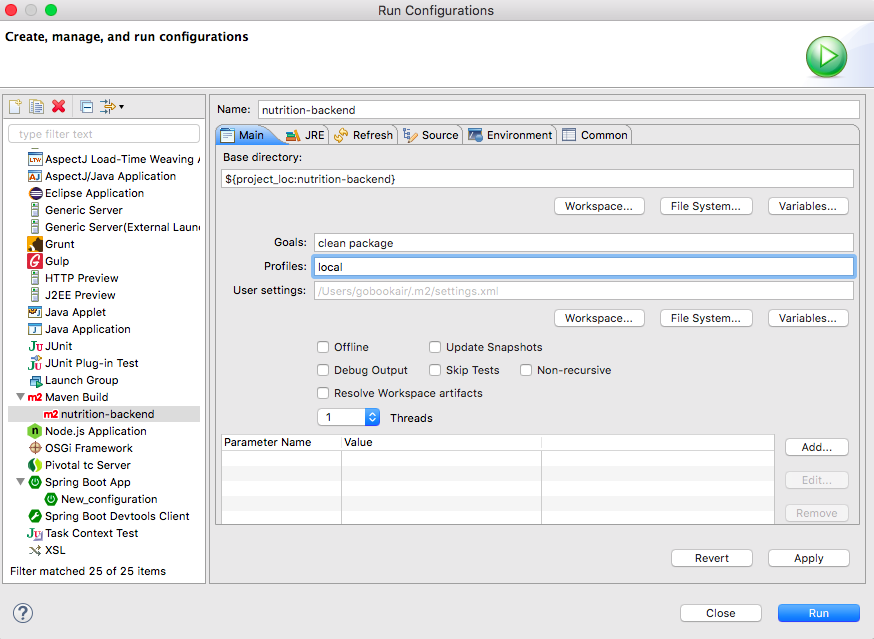
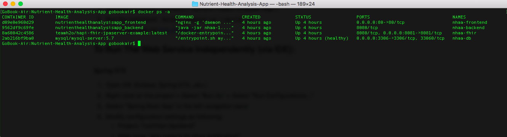

# Nutrient-Health-Analysis-App
Nutrient Health Analysis App for team H20

## Table of contents
-----

- [To Run the Full Solution via Docker](#to-run-the-full-solution-via-docker)
	- [Command-Line Tool](#command-line-tool)
- [To Run the Web Service Independently via IDE](#to-run-the-web-service-independently-via-ide)
	- [Using Spring STS](#using-spring-sts)
	- [Using Command-Line Tool](#using-command-line-tool)
- [To Run the Frontend Application Independently](#to-run-the-frontend-application-independently)
- [API Endpoints](#api-endpoints)
	- [Registration and Authentication](#registration-and-authentication)
	- [Food Entry](#food-entry)
	- [USDA Food Database](#usda-food-database)
	- [FHIR Health Data Entry](#fhir-health-data-entry)
	- [User Profile](#user-profile)
	- [Goals](#goals)
	- [Alerts](#alerts)
- [Clean and Dockerize](#clean-and-dockerize)
	- [To Delete Docker Container and Image and Re-run the Application](#to-delete-docker-container-and-image-and-re-run-the-application)
	- [To Delete Docker Container only and Re-run the application](#to-delete-docker-container-and-image-and-re-run-the-application)
- [Caution](#caution)
	- [FHIR Server](#fhir-server)

## To Run The Full Solution via Docker:

#### Command-Line Tool
1. Navigate to project directory ("Nutrient-Health-Analysis-App")
2. Run the command: ``docker-compose up --build -d``
3. Access the site via [http://localhost](http://localhost)

## To Run The Web Service Independently (via IDE):

#### Using Spring STS
1. Open IDE (Eclipse, Spring STS...etc.)
2. Right click on the project > Select "Run As" > Select "Run Configurations..."
3. Select "Spring Boot App" in the left navigation pane
4. Modify configuration settings as following:
	- Project: "nutrition-backend"
	- Main type: "edu.gatech.ihi.nhaa.Application"
	- Profile: "local"


5. Once the Spring Boot application started, access the service via [http://localhost:8080](http://localhost:8080)

#### Using Command-Line Tool
1. Navigate to "nutrition-backend" directory.
2. Run "mvn clean install"
3. Once `nhaa-1.0.0.jar` is created under "target" directory, run one of the following commands:
	- mvn spring-boot:run
	- java -jar -Dspring.profiles.active=local target/nhaa-1.0.0.jar
5. Once the Spring Boot application started, access the service via [http://localhost:8080](http://localhost:8080)

## To Run the Frontend Application Independently:

1. Open CLI tool
2. Navigate to project directory
3. Run the command ``npm install``
4. Run the command ``npm start``
5. Once the frontend started, access webpage via [http://localhost:4200](http://localhost:4200)

## API Endpoints

#### Registration and Authentication

* **Register a new user**
	* **URL:** `/auth/register`
	* **Method:** `POST`
	* **URL Params:** NONE
	* **Data Params:** `{firstName: Bob, lastName: Job, email: bobjob@email.com, password: coolbobjob }`
	* **Success Response:**
		* **Code:** 204
	* **Error Response:**
		* **Code:** 500

* **Login with user name and password**
	* **URL:** `/auth/login`
	* **Method:** `POST`		
	* **URL Params:** NONE
	* **Data Params:** `{email: bobjob@email.com, password: coolbobjob}`
	* **Success Response:** 			
		* **Code:** 204
	* **Error Response:**				
		* **Code:** 403

#### Food Entry

* **Add a new food entry**
	* **URL:** `/food-entries`
	* **Method:** `POST`
	* **URL Params:** NONE
	* **Data Params:** ```{name: bacon, consumptionDate: 2017-12-25T09:00:00.000Z, servings: 2.5, notes: Sample food entry, nutrients: [{name: fat, units: g, value: 2.22}]}```
	* **Success Response:**
		* **Code:** 204
	* **Error Response:**
		* **Code:** 500

* **Retrieve all food entries submitted by the user**
	* **URL:** `/food-entries`
	* **Method:** `GET`		
	* **URL Params:** NONE
	* **Data Params:** NONE
	* **Success Response:** 			
		* **Code:** 200
		* **Content:** ```[{foodEntryId: 1, userId: bobjob@email.com, name: bacon, consumptionDate: 2017-12-25T09:00:00.000Z, servings: 2.5, notes: Sample food entry, nutrients: [{name: fat, units: g, value: 2.22}]}]```
	* **Error Response:**				
		* **Code:** 500

* **Retrieve a food entry by id**		
	* **URL:** `/food-entries/:id`
	* **Method:** `GET`		
	* **URL Params:**

		**REQUIRED:** `id=[integer]`
	* **Data Params:** NONE
	* **Success Response:** 			
		* **Code:** 200
		* **Content:** ```{foodEntryId: 1, userId: bobjob@email.com, name: bacon, consumptionDate: 2017-12-25T09:00:00.000Z, servings: 2.5, notes: Sample food entry, nutrients: [{name: fat, units: g, value: 2.22}]}```
	* **Error Response:**				
		* **Code:** 500

* **Retrieve food entry by food name**		
	* **URL:** `/food-entries/:name`
	* **Method:** `GET`		
	* **URL Params:**

		**REQUIRED:** `name=[string]`
	* **Data Params:** None
	* **Success Response:** 			
		* **Code:** 200
		* **Content:** ```{foodEntryId: 1, userId: bobjob@email.com, name: bacon, consumptionDate: 2017-12-25T09:00:00.000Z, servings: 2.5, notes: Sample food entry, nutrients: [{name: fat, units: g, value: 2.22}]}```
	* **Error Response:**				
		* **Code:** 500

* **Retrieve food entry by food name**		
	* **URL:** `/food-entries/:name`
	* **Method:** `GET`		
	* **URL Params:**

		**REQUIRED:** `startDate=[datetime]` `endDate=[datetime]` `unifyUnits=[boolean]`
	* **Data Params:** None
	* **Success Response:** 			
		* **Code:** 200
		* **Content:** ```{foodEntryId: 1, userId: bobjob@email.com, name: bacon, consumptionDate: 2017-12-25T09:00:00.000Z, servings: 2.5, notes: Sample food entry, nutrients: [{name: fat, units: g, value: 2.22}]}```
	* **Error Response:**				
		* **Code:** 500

* **Delete food entry by id**		
	* **URL:** `/food-entries/:id`
	* **Method:** `DELETE`		
	* **URL Params:**

		**REQUIRED:** `id=[integer]`
	* **Data Params:** None
	* **Success Response:** 			
		* **Code:** 204
	* **Error Response:**				
		* **Code:** 500

#### USDA Food Database

* **Retrieve nutrient reports by food identifier ("ndbno")**		
	* **URL:** `/foods/:ndbno`
	* **Method:** `GET`		
	* **URL Params:**

		**REQUIRED:** `ndbno=[string]`
	* **Data Params:** None
	* **Success Response:** 			
		* **Code:** 200
		* **Content:** ```{"foodId":null,"name":"MILLER'S CHEESE, STRING CHEESE, PART SKIM - LOW MOISTURE MOZZARELLA CHEESE, UPC: 078812369806","consumptionDate":null,"servings":null,"notes":null,"nutrients":[{"name":"Fat","value":17.86,"units":"g"},{"name":"Carbohydrate","value":3.57,"units":"g"},{"name":"Fiber","value":0.0,"units":"g"},{"name":"Sugar","value":0.0,"units":"g"},{"name":"Iron","value":0.0,"units":"mg"},{"name":"Fat","value":10.71,"units":"g"},{"name":"Fat","value":0.0,"units":"g"}]}```
	* **Error Response:**				
		* **Code:** 500

* **Search for foods by food name**		
	* **URL:** `/foods`
	* **Method:** `GET`		
	* **Query Params:**

		**REQUIRED:** `name=[string]`
	* **Data Params:** None
	* **Success Response:** 			
		* **Code:** 204
		* **Content:** ```[{"nbdno":"45044527","name":"MILLER'S CHEESE, STRING CHEESE, PART SKIM - LOW MOISTURE MOZZARELLA CHEESE, UPC: 078812369806"},{"nbdno":"45052451","name":"FRIGO, CHEESE HEADS, SWIRLS, MOZZARELLA CHEESE, CHEDDAR CHEESE, UPC: 041716846025"}]```
	* **Error Response:**				
		* **Code:** 500

#### FHIR Health Data Entry

* **Add a new health data entry**
	* **URL:** `/health-entries`
	* **Method:** `POST`
	* **URL Params:** NONE
	* **Data Params:**
	* **Success Response:**
		* **Code:** 204
		* **Content:** ```{"healthEntryType":"Weight","value":50,"units":"lbs","date":"2017-12-03T21:28:45.000Z","notes":"Weight details"}```
	* **Error Response:**
		* **Code:** 500

* **Retrieve all health data entries submitted by the user**
	* **URL:** `/health-entries`
	* **Method:** `GET`		
	* **URL Params:** NONE
	* **Data Params:** NONE
	* **Success Response:** 			
		* **Code:** 200
		* **Content:** ```[{"id":"597738","healthEntryType":"Weight","value":22.70,"units":"kg","date":"2017-12-03T21:28:45.000Z","notes":"Weight details"}]```
	* **Error Response:**				
		* **Code:** 500

* **Retrieve all food entries by date range**		
	* **URL:** `/food-entries/:id`
	* **Method:** `GET`		
	* **Query Params:**

		**REQUIRED:** `startDate=[datetime]` `endDate=[datetime]`
	* **Data Params:** NONE
	* **Success Response:** 			
		* **Code:** 200
		* **Content:** ```{"id":"597738","healthEntryType":"Weight","value":22.70,"units":"kg","date":"2017-12-03T21:28:45.000Z","notes":"Weight details"}```
	* **Error Response:**				
		* **Code:** 500

* **Delete all health data entries under the user**		
	* **URL:** `/health-entries`
	* **Method:** `DELTE`		
	* **URL Params:** NONE
	* **Data Params:** NONE
	* **Success Response:** 			
		* **Code:** 204
	* **Error Response:**				
		* **Code:** 500

* **Delete health data entry by health entry id**		
	* **URL:** `/health-entries/:id`
	* **Method:** `DELETE`		
	* **URL Params:**

		**REQUIRED:** `id=[string]`
	* **Data Params:** None
	* **Success Response:** 			
		* **Code:** 204
	* **Error Response:**				
		* **Code:** 500

#### User Profile

* **Get user profile**		
	* **URL:** `/user`
	* **Method:** `GET`		
	* **URL Params:** NONE
	* **Data Params:** NONE
	* **Success Response:** 			
		* **Code:** 200
		* **Content:** ```{"firstName":"Tom","lastName":"Bob","password":null,"email":"tombob@gmail.com","patientId":"13548153-723f-4839-956a-3f734308d8b0"}```
	* **Error Response:**				
		* **Code:** 500

* **Update user profile**		
	* **URL:** `/user`
	* **Method:** `PATCH`		
	* **URL Params:** NONE
	* **Data Params:** ```{"firstName":"Tom","lastName":"Bob","password":"koombaya","email":"tomtom@gmail.com","patientId":"13548153-723f-4839-956a-3f734308d8b0"}```
	* **Success Response:** 			
		* **Code:** 204
	* **Error Response:**				
		* **Code:** 500

#### Goals

* **Retrieve all goals**
	* **URL:** `/goals`
	* **Method:** `GET`
	* **URL Params:** NONE
	* **Data Params:** NONE
	* **Success Response:**
		* **Code:** 200
		* **Content:** ```[
    {
        "goalId": 2,
        "name": "Weight",
        "value": 120,
        "date": "2017-12-04T23:04:18.000Z",
        "goalType": "Less Than",
        "entryType": "Weight",
        "units": "lbs",
        "timePeriod": "Instant"
    }
]```
	* **Error Response:**
		* **Code:** 500

* **Retrieve goal by goal id**
	* **URL:** `/goal/:goalId`
	* **Method:** `GET`		
	* **URL Params:** `goalId=[integer]`
	* **Data Params:** NONE
	* **Success Response:** 			
		* **Code:** 200
		* **Content:** ```{
    "goalId": 2,
    "name": "Weight",
    "value": 120,
    "date": "2017-12-04T23:04:18.000Z",
    "goalType": "Less Than",
    "entryType": "Weight",
    "units": "lbs",
    "timePeriod": "Instant"
}```
	* **Error Response:**				
		* **Code:** 500

* **Retrieve all goals by date time**		
	* **URL:** `/goals/:date`
	* **Method:** `GET`		
	* **Query Params:**

		**REQUIRED:** `date=[datetime]`
	* **Data Params:** NONE
	* **Success Response:** 			
		* **Code:** 200
		* **Content:** ```[
    {
        "goalId": 2,
        "name": "Weight",
        "value": 120,
        "date": "2017-12-04T23:04:18.000Z",
        "goalType": "Less Than",
        "entryType": "Weight",
        "units": "lbs",
        "timePeriod": "Instant"
    }
]```
	* **Error Response:**				
		* **Code:** 500

* **Add new goal **		
	* **URL:** `/goals`
	* **Method:** `POST`		
	* **URL Params:** NONE
	* **Data Params:** ```{"entryType":"Weight","units":"lbs","goalType":"Less Than","name":"Super Diet","date":"2017-12-04T21:41:17.000Z","timePeriod":"Last 24 Hours","value":100}```
	* **Success Response:** 			
		* **Code:** 204
	* **Error Response:**				
		* **Code:** 500

* **Update goal**		
	* **URL:** `/goals/:goalId`
	* **Method:** `PATCH`		
	* **URL Params:**

		**REQUIRED:** `goalId=[string]`
	* **Data Params:** ```{"goalId":2,"name":"Weight","value":120,"date":"2017-12-04T23:04:18.000Z","goalType":"Less Than","entryType":"Weight","units":"lbs","timePeriod":"Instant"}```
	* **Success Response:** 			
		* **Code:** 204
	* **Error Response:**				
		* **Code:** 500

* **Delete goal by goal id**		
	* **URL:** `/goals/:goalId`
	* **Method:** `DELETE`		
	* **URL Params:**

		**REQUIRED:** `goalId=[string]`
	* **Data Params:** NONE
	* **Success Response:** 			
		* **Code:** 204
	* **Error Response:**				
		* **Code:** 500

* **Retrieve all current goal states**		
	* **URL:** `/goals/states`
	* **Method:** `GET`		
	* **URL Params:** NONE
	* **Data Params:** NONE
	* **Success Response:** 			
		* **Code:** 200
		* **Content:** ```[{"goal":{"goalId":2,"name":"Weight","value":120.0,"date":"2017-12-04T23:04:18.000Z","goalType":"Less Than","entryType":"Weight","units":"lbs","timePeriod":"Instant"},"state":"Unknown","currentValue":null}]```
	* **Error Response:**				
		* **Code:** 500

#### Alerts

* **Retrieve all alerts**
	* **URL:** `/alerts`
	* **Method:** `GET`
	* **URL Params:** NONE
	* **Data Params:** NONE
	* **Success Response:**
		* **Code:** 200
		* **Content:** ```[
    {
        "alertId": 3,
        "entryType": "Weight",
        "value": 140,
        "units": "lbs",
        "alertType": "Greater Than",
        "timePeriod": "Last 24 Hours"
    }
]```
	* **Error Response:**
		* **Code:** 500

* **Retrieve alert by alert id**
	* **URL:** `/alerts/:alertId`
	* **Method:** `GET`		
	* **URL Params:** `alertId=[integer]`
	* **Data Params:** NONE
	* **Success Response:** 			
		* **Code:** 200
		* **Content:** ```{
    "alertId": 3,
    "entryType": "Weight",
    "value": 140,
    "units": "lbs",
    "alertType": "Greater Than",
    "timePeriod": "Last 24 Hours"
}```
	* **Error Response:**				
		* **Code:** 500

* **Retrieve all current alert states**		
	* **URL:** `/alerts/states`
	* **Method:** `GET`		
	* **URL Params:** NONE
	* **Data Params:** NONE
	* **Success Response:** 			
		* **Code:** 200
		* **Content:** ```[{"alert":{"alertId":3,"entryType":"Weight","value":140.0,"units":"lbs","alertType":"Greater Than","timePeriod":"Last 24 Hours"},"state":"Unknown","currentValue":null}]```
	* **Error Response:**				
		* **Code:** 500

* **Add new alert**		
	* **URL:** `/alerts`
	* **Method:** `POST`		
	* **URL Params:** NONE
	* **Data Params:** ```{"entryType":"Weight","units":"lbs","alertType":"Greater Than","timePeriod":"Daily Average for Last Week","value":130}```
	* **Success Response:** 			
		* **Code:** 204
	* **Error Response:**				
		* **Code:** 500

* **Update alert**		
	* **URL:** `/alerts/:alertId`
	* **Method:** `PATCH`		
	* **URL Params:**

		**REQUIRED:** `alertId=[integer]`
	* **Data Params:** ```{"alertId":2,"entryType":"Glucose","value":20,"units":"mg/dL","alertType":"Greater Than","timePeriod":"Last 24 Hours"}```
	* **Success Response:** 			
		* **Code:** 204
	* **Error Response:**				
		* **Code:** 500

* **Delete alert by alert id**		
	* **URL:** `/alerts/:alertId`
	* **Method:** `DELETE`		
	* **URL Params:**

		**REQUIRED:** `alertId=[integer]`
	* **Data Params:** NONE
	* **Success Response:** 			
		* **Code:** 204
	* **Error Response:**				
		* **Code:** 500

## Clean and Dockerize

#### To Delete Docker Container and Image and Re-run the Application
1. Run the command: ``docker ps -a``

2. Locate "CONTAINER ID" for the following images:
	- "nutrienthealthanalysisapp_frontend"
	- "nutrienthealthanalysisapp_backend"
	- "mysql/mysql-server:5.7"
3. Run the command ``docker stop <container id>`` and stop the container for each images.
4. Delete each container by running the command ``docker rm <container id>``
5. Run the command ``docker rmi $(docker images -q)`` to delete all images.
6. Once the containers and images are deleted, run the command ``docker-compose up --build -d`` to build and run the docker image.
7. Access the site via [http://localhost](http://localhost)

#### To Delete Docker Container only and Re-run the Application
1. Run the command: ``docker ps -a``

2. Locate "CONTAINER ID" for the following images:
	- "nutrienthealthanalysisapp_frontend"
	- "nutrienthealthanalysisapp_backend"
	- "mysql/mysql-server:5.7"
3. Run the command ``docker stop <container id>`` and stop the container for each images.
4. Delete each container by running the command ``docker rm <container id>``
5. Run the command ``docker rmi $(docker images -q)`` to delete all images.
6. Once the containers and images are deleted, run the command ``docker-compose -f docker-compose.prebuilt.yml`` to reuse the existing docker images.
7. Access the site via [http://localhost](http://localhost)

## Caution

##### FHIR Server:
- FHIR server is unstable and user may run into issues connecting to the FHIR server. Please check if FHIR server is up and running.
- Nutrient-Health-Analysis-App uses port 3306, 8080 and 80; therefore, those ports need to be open before building and running docker image.
